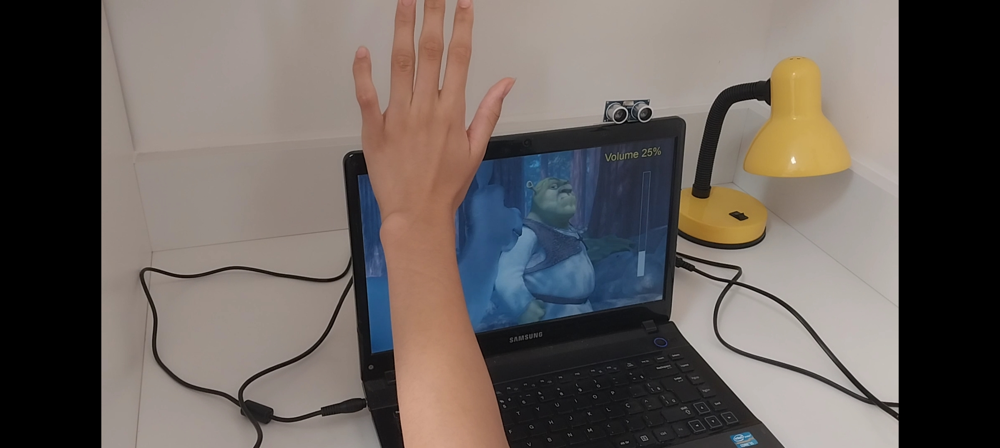

# Gesture-Control-Using-Python

- [Overview](#overview)
  - [Screenshot](#screenshot)
  - [How to Use It](#how-to-use-it)
- [Process](#process)
  - [Built with](#built-with)
  - [Installing Python Libraries](#installing-python-libraries)
  - [References](#references)
- [Authors](#authors)

## Overview
This repository contains a project focused on automation using Python and Arduino. The Python code listens to serial communication with the Arduino board and triggers keyboard commands on the computer. The Arduino is used to measure distances with two sensors and sends commands to the computer based on hand gestures. This project demonstrates how Python can be used for automation, allowing us to control the computer through external devices.

In Vlc Player, users should be able to:

- Play/Pause
- Rewind
- Forward
- Vup
- Vdown

### Screenshot





### How to Use it
- Push both left and right hands in to Play/Pause
- Push right hand in to rewind
- Pull right hand out to play the video forward
- Push left hand in to Vup
- Pull right hand out to Vdown

## Process

### Built with

- 1x Arduino MEGA 2560
- 1x USB A to USB B Cable
- 8x Male to Female Jumper Wires
- 2x Ultrasonic Sensors HC-SRO4

### Debuging

First things first, it was important to check whether the sensors were working properly:

```C
const int trigPin1 = 2; // Trigger pin of Sensor 1
const int echoPin1 = 3; // Echo pin of Sensor 1
const int trigPin2 = 4; // Trigger pin of Sensor 2
const int echoPin2 = 5; // Echo pin of Sensor 2

void setup() {
  // Initialize serial communication
  Serial.begin(9600);
  
  // Set the trigger pins as outputs
  pinMode(trigPin1, OUTPUT);
  pinMode(trigPin2, OUTPUT);
  
  // Set the echo pins as inputs
  pinMode(echoPin1, INPUT);
  pinMode(echoPin2, INPUT);
}

void loop() {
  // Read from sensor 1
  digitalWrite(trigPin1, LOW);
  delayMicroseconds(2);
  digitalWrite(trigPin1, HIGH);
  delayMicroseconds(10);
  digitalWrite(trigPin1, LOW);
  
  long duration1 = pulseIn(echoPin1, HIGH);
  int distance1 = duration1 * 0.034 / 2;
  
  // Read from sensor 2
  digitalWrite(trigPin2, LOW);
  delayMicroseconds(2);
  digitalWrite(trigPin2, HIGH);
  delayMicroseconds(10);
  digitalWrite(trigPin2, LOW);
  
  long duration2 = pulseIn(echoPin2, HIGH);
  int distance2 = duration2 * 0.034 / 2;
  
  // Print out the distances to the serial monitor
  Serial.print("Distance Sensor 1: ");
  Serial.print(distance1);
  Serial.println(" cm");
  
  Serial.print("Distance Sensor 2: ");
  Serial.print(distance2);
  Serial.println(" cm");
  
  // Wait a little before taking another reading
  delay(1000);
}
```
### Installing Python Libraries
After checking the sensors, it's necessary to do this setup Python installation in order to use any library in the source code
```bash
python –m pip install –-upgrade pip

python –m pip install pyautogui
```

### References

- [Gesture control using Arduino and Python](https://www.youtube.com/watch?v=sC5FNQU71gA&t=0s) - Where the inspiration came for building the project!
- [Gesture Controlled Computer !!!](https://www.youtube.com/watch?v=OjhrCr0zzgs) - This helped for setting up the Arduino and Python code. All information was well documented and very educational, though the code itself was somewhat outdated, it was something easy to fix.

## Authors
Gabriel Barsani & Jonathan Zen

- Linkedin - [@Gabriel Tavares Barsani](https://br.linkedin.com/in/gabrielbarsani113)
- Linkedin - [@Jonathan Zen](https://br.linkedin.com/in/jonathan-zen-450997115?original_referer=https%3A%2F%2Fwww.google.com%2F)
